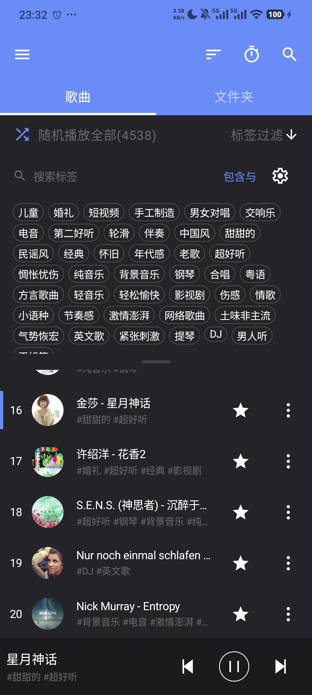
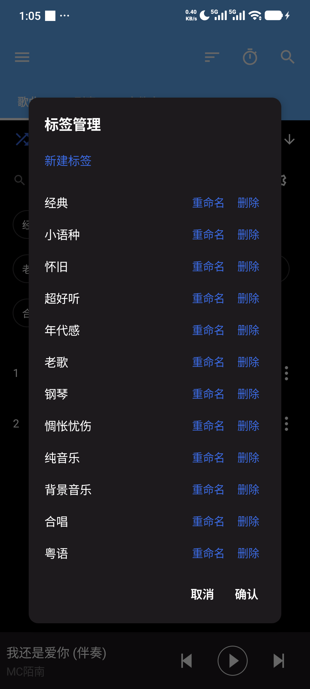
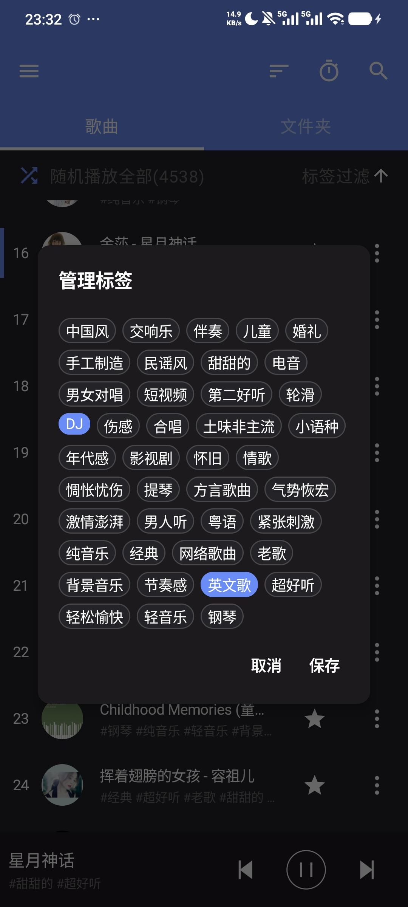
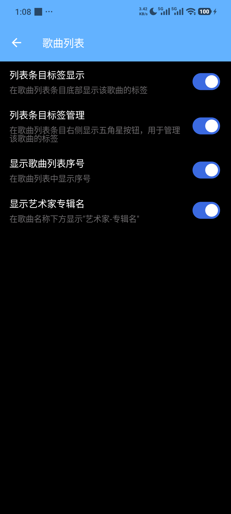
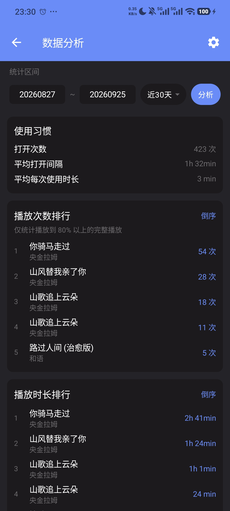
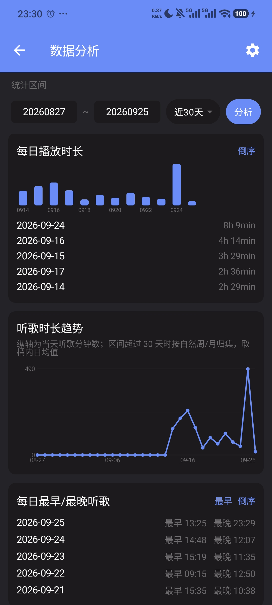
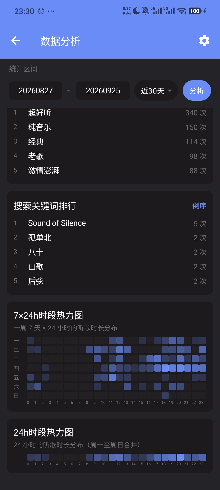

# [English](/README.md)

# APlayer - 安卓本地音乐播放器

## 简介
APlayer 是一款基于 Jetpack Compose 重构的简洁、功能强大的本地音乐播放器，拥有**超级强大的标签管理及对应的筛选功能**，以及**丰富的数据分析**。你可以用标签对歌曲进行分类、筛选、排除，让曲库井井有条；除常规播放外，它支持用自定义标签整理曲库、用丰富的统计报表了解听歌习惯，并能按自己的喜好个性化界面——排序规则、文件名显示、热力图与分析模块等。

## 下载

## 本分支新增：标签管理
本分支在原项目基础上新增**标签管理音乐**功能：给歌曲打上"助眠/轻音乐/钢琴/怀旧"等标签，即可按标签一键过滤出想听的音乐。适合睡觉、工作等场景——比如睡前用"助眠/钢琴"过滤出轻音乐，而用列表一个个翻找很不方便。

### 截图
|   |   |   |   |
|:-:|:-:|:-:|:-:|
|  |  |  |  |
| 歌曲列表 | 标签过滤 | 标签管理 | 单曲打标签 |

|   |   |
|:-:|:-:|
|  |  |
| 批量打标签 | 歌曲列表设置 |

|   |   |   |
|:-:|:-:|:-:|
|  |  |  |
| 数据分析统计 | 每日统计与趋势 | 标签排行与热力图 |

### 特点
- 标签管理音乐：给歌曲打上"助眠/轻音乐/钢琴/怀旧"等标签，支持按标签快速过滤；标签写入音频文件自定义字段（`AUDIO_TAGS`），重装应用/换设备不丢失
- 标签过滤区：歌曲列表顶部可展开/收起，支持标签实时搜索、拖动调整高度、"与/或"逻辑组合过滤
- 标签管理弹窗：创建、重命名、删除标签，支持"无标签"过滤
- 批量打标签：多选歌曲后批量"添加到标签/从标签移除"
- 单曲标签管理：列表条目五角星按钮一键管理该歌曲标签，点"保存"才写入音频文件
- 播放队列联动：过滤结果即播放列表，切换标签时当前歌曲保持播放不打断
- 数据分析：丰富的数据统计与可视化报表——播放次数/播放时长/跳过排行、每日播放时长、每日最早/最晚听歌、标签歌曲数量、最常播放的标签，以及 7×24h / 24h 时段热力图，帮助你了解自己的听歌习惯
- 设置-歌曲列表：新增"列表条目标签显示/列表条目标签管理/显示歌曲列表序号/显示艺术家专辑名"四个开关
- 底部栏新增"上一首"按钮，取消专辑封面控件
- 标签写入失败弹窗（可复制错误信息）、日志导出/清空，便于排查问题
- 数据分析设置弹窗：可开关每个分析模块（排行/图表/热力图等）并设置每类列表行数；热力图支持单色/多色与横坐标时间个数（24/12/8/6）切换
- 歌曲列表排序规则可自定义：在排序菜单中勾选要显示的排序方式（至少保留 1 项）
- 底部栏与播放页标题可显示文件名（而非元数据歌名）
- 修改歌曲元数据（歌名/歌手/专辑）后会同步更新播放事件统计，排行即时显示新歌名
- 标签支持通过系统文件选择器导出/导入（按文件路径备份为 JSON）
- 支持按模板（{title}{artist}{album}{track}{year}）批量重命名歌曲；可在设置中配置"默认重命名模板"

## 截图
|   |   |   |   |
|:-:|:-:|:-:|:-:|
|  |  |  |  |
| 主页 | 专辑 | 播放页封面 | 播放页歌词 |

|   |   |   |   |
|:-:|:-:|:-:|:-:|
|  |  |  |  |
| 深色模式 | 睡眠定时 | 桌面 歌词 & 组件 | 锁屏 |

|   |   |   |
|:-:|:-:|:-:|
|  |  |  |
| 横屏主页 | 横屏播放 | 横屏桌面 歌词 & 组件 |

## 特点
- 首页 Tab 可配置：歌曲/艺术家/专辑/文件夹/播放列表/远程(WebDAV)
- 歌词体验：内嵌/本地/在线歌词(网易/酷狗/QQ)，支持逐字歌词与优先级设置
- 悬浮歌词与桌面小组件
- 主题：普通/暗色/纯黑，支持自定义主题色
- 专辑/艺术家封面自动补全
- 内置标签编辑器：标题/歌手/专辑/歌词
- 歌单管理：创建、编辑、导入、导出，支持每个歌单独立排序
- WebDAV 支持：个人云盘串流播放
- 音效与控制：均衡器、播放速度、睡眠定时
- 锁屏控制与通知栏播放控制
- 蓝牙/有线耳机按键控制
- 自动扫描媒体库，或手动扫描目录

## 多语言（i18n）

本 App 支持**任意语言**的切换，不仅限于内置的中文 / 英文：

- 内置语言（跟随系统 / 简体中文 / 繁體中文 / 日本語）可直接在「设置 → 语言」中选择；
- 其它任何语言（如法语、西班牙语、韩语等）无需重新打包：
  1. 进入「设置 → 语言」；
  2. 点击「导出模板」，系统会弹出提示告知模板保存位置（需确认后才能关闭弹窗），将该 `.json` 模板发给 AI 翻译；
  3. 点击「AI 翻译提示词」复制提示词，连同模板一起交给 AI，并告诉它目标语言；
  4. 把 AI 生成的 `.json` 通过「导入模板」导入即可，导入后语言列表会出现新语言，选中即生效。
- 导出的模板以英文为源语言，模板中的 key 与 App 内文案一一对应；导入后只覆盖对应文案，缺失项回退到内置资源。

## 感谢
- [XXPermissions](https://github.com/getActivity/XXPermissions)
- [Retrofit](https://github.com/square/retrofit)
- [Timber](https://github.com/JakeWharton/timber)
- [Leakcanary](https://github.com/square/leakcanary)
- [ImageCropper](https://github.com/CanHub/Android-Image-Cropper)
- [TinyPinyin](https://github.com/promeG/TinyPinyin)
- [TagLib for Android](https://github.com/rRemix/taglib)
- 原项目：[rRemix/APlayer](https://github.com/rRemix/APlayer)

## 最后
- 如果喜欢或者能给你提供帮助，欢迎Star
- 因为是刚学安卓的时候就开始做了，很多代码待完善或者重构，还有一些待开发的功能，欢迎Pull Request
- 关于此分支，有任何问题可以发邮件到我的邮箱: fucaijin999@gmail.com
